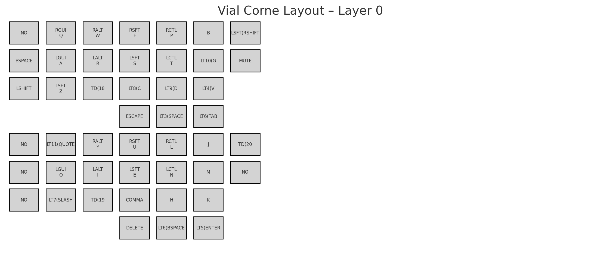
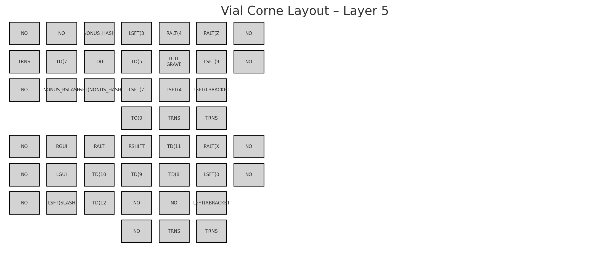
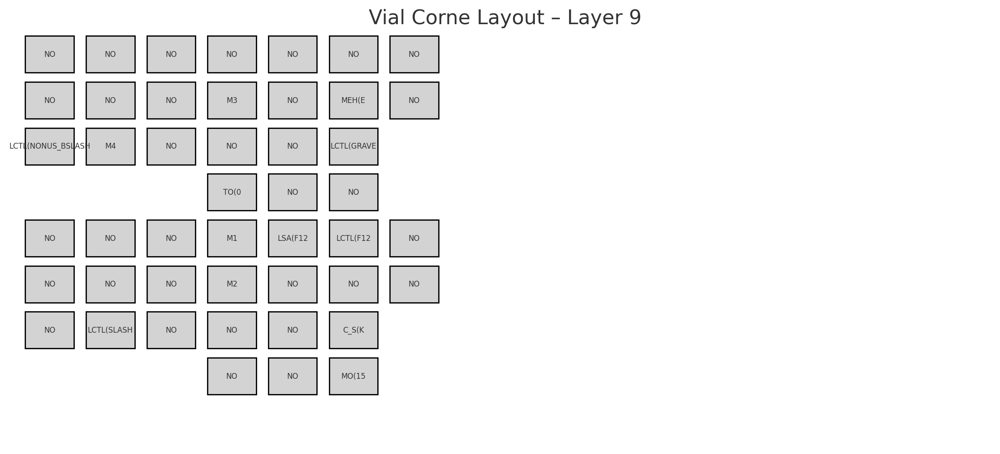
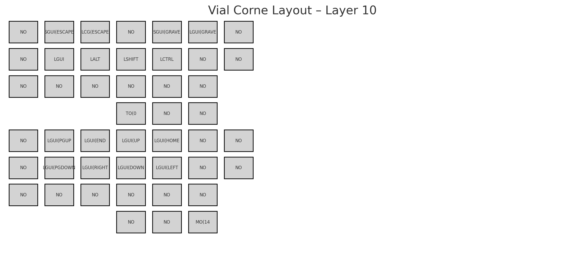

# Vial Corne Rotary Miryoku-ish Layout

This repository contains the Vial keymap layout for the Corne keyboard with rotary support and Miryoku-inspired layering.

## Layer Images
### Layer 0

### Layer 1

### Layer 2

### Layer 3

### Layer 4

### Layer 5

### Layer 6

### Layer 7

### Layer 8

### Layer 9

### Layer 10

### Layer 11

### Layer 12

### Layer 13

### Layer 14

### Layer 15

